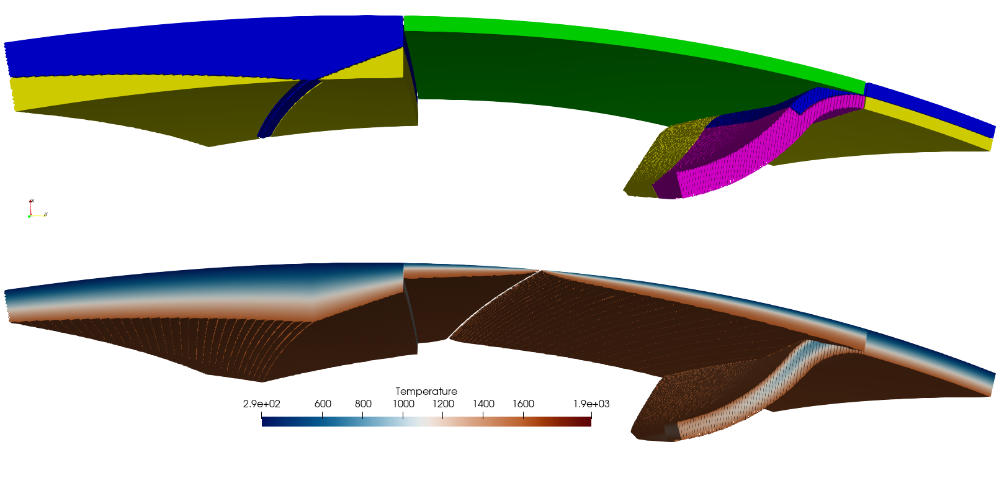

# Summary

Many Earth science applications require the discretization, parametrization and/or visualization of complex geological features in a 3D geometry in global or regional settings. A prime example are geodynamic models, which have to make assumptions about the Earth's thermal and chemical structure and the geometry of different features such as plates, subducted slabs, or mantle plumes. This structure is needed in instantaneous models, as model initial conditions, or to test different hypotheses and compare model predictions to observations. Other examples are the creation of an Earth velocity structure for seismic forward modeling and hypothesis-testing, or the visualization of tectonic features in structural geology.

The Geodynamic World Builder (GWB) has been designed to make the creation of initial conditions for complex parameterized models significantly easier, but can also be used to design simple synthetic models and several types of datasets are supported to be used to setup models in a way which aligns with the GWB design philosophies.

Besides setting up initial conditions for geodynamic models, the GWB can also be used to make detailed 3D visualizations of geologic and geodynamic settings.

# Statement of need

The increase in available computational resources and new numerical methods and infrastructure, has started to enable the creation of numerical models which closer resemble or mimic actual location on the Earth in 3D with a much finer resolution. This also means that setting up these more detailed regional or global models, becomes exponentially more difficult, both in 2D, but especially in 3D. Furthermore, to properly investigate these models, often many smaller and bigger changes to the model need to be tested, which requires a way to change these models quickly and easily. Although successful studies have been published, such model setups often have one or many of the following issues:

1. Code is not readable (even hard for their developers)
2. Code/initial conditions is/are not modifiable (even hard for their developers)
3. Code is not extendable
4. Code is not portable or reproducible in other codes
5. Code is not shareable which makes everyone reinvent the wheel.

This is the problem the GWB was designed to solve. Furthermore, since the GWB comes with its own programs to visualize the constructed model through programs like Paraview, and creating the models requires no programming knowledge, it can be easily used to visualize tectonic and geodynamic settings for publication, teaching or discussion purposes. 

Other tools to solve this problem have emerged at around the same time as the first GWB release (@Fraters_Thieulot_etal_2019). Examples include GeomIO (@Bauville_Baumann_2019,@Spang_Baumann_2022), which use an approach based on vector graphics, Easy (https://easyinit.readthedocs.io/), which uses a more generic function based approach, UWGeodynamics (@Beucher_Moresi_etal_2019) is which specificially designed for Underworld (@Moresi_Dufour_2002) and GemPy (@Varga_Schaaf_2019,@Schaaf_Varga_2021), which is designed for structural modelling. 

# Methods

The Geodynamic World Builder is designed to solve the problems stated in the pervious section through implementing a specific code an user design philosophy.
## GWB Code Philosophy
The code philosophy is build around the following points:

1. A single text-based input file
2. Code, language and platform independent
    1. Supports **Linux**, **OSX** and **Windows**
    2. Has official interfaces for **C++**, **C**, **FORTRAN** and **Python** coupling
3. Safe to use in parallel codes
4. Readable and extensible (modular) codes
5. Strict version numbering to ensure reproducible results

Following these points will help to create a clean, portable, extendable code with reproducible results. This is of course not everything needed to reach such results. For example, having integration and unit tests with high code coverage and automatic code indentation are important to keep the GWB in a healthy state.

## GWB User Philosophy

The user philosophy is build around the idea that users define tectonic features. These tectonic features can be parameterized by defining lines or areas where these features are in a map view. For example, a continental plate is an area on a map, so the user defines the area. A fault is a line on a map, so the user defines that line where the fault is. The user also provides information on the feature, such a thickness, which can be spatially variable, or dip angles. These parameters are then used to create the volume for the feature. Next users can attach one or many models to those volumes to define for example temperature or compositional variables. These can be very simple models, such as a uniform temperture distribution, or a more complex distrubution, such as a half space cooling model, or a McKenzie [@McKenzie_1970] or mass conserving [@billen_Fraters_AGU_2023] slab temperature model. 

All these parameterizations are set through a single input file. This file a JSON styled input file, which human read, write and editable. The main idea behind this design of the GWB so that users can easily create and modify complex parameterized initial conditions for their geodynamic or tectonic setting. 

## Example 
Below we show an example input file for a cartesian model, which can be easily converted to a spherical model, such as shown in the figure below which also shows some extra capabilities.

```json
{
  "version": "1.0",
  "coordinate system":{"model":"cartesian"},
  "features":
  [
    {
       "model":"oceanic plate", "name":"Overriding Plate", "max depth":100e3, 
       "coordinates":[[0,0],[0,1000e3],[1500e3,1000e3],[1600e3,350e3],[1500e3,0]],
       "temperature models":[{"model":"linear", "max depth":100e3}],
       "composition models":[{"model":"uniform", "compositions":[0]}]
    },
    { 
      "model":"subducting plate", "name":"Slab", "dip point":[0,0],
      "coordinates":[[1500e3,1000e3],[1600e3,350e3],[1500e3,0]],
      "segments":[{"length":300e3, "thickness":[100e3], "angle":[0,60]}],
      "temperature models":[{"model":"plate model", "plate velocity":0.02}],
    }
  ]
}
```




# Acknowledgements

We would like to acknowledge all other contributors to the project, especially Lorraine Hwang, Becky Fildes and John Naliboff for their advice and support through the years for this project. We would also like to acknowledge NSF for their funding and support through grants EAR-1620618 (CPO), OCE-1948902 (Cascadia), EAR-0949446 (CIG), EAR-1550901 (CIG) and EAR-1925677 (FRES).

# References


