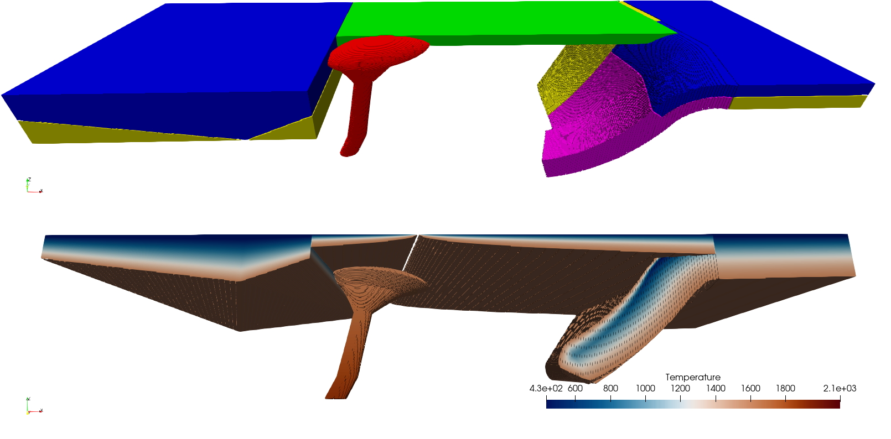

# Summary

The geodynamic models can be divided in three broad classes. The first class are the simple synthetic models. This class which involve simplistic geometries for generic modeling and are easy to make and parameterize. These are good for simplified problems and benchmarks. The second class of models is the Data driven models. This class which consists of initial conditions (semi-)automatically derived from datasets like tomography. These are often used for instantaneous models. The third class of models are complex synthetic models. The case which blends complex 3D interpretation driven detailed geometrical features and thermal fields. This can be useful to parameterize instantaneous models or make setups for models starting in the past.  

The Geodynamic World Builder (GWB) has been designed to make the third case significantly easier, but can also be used to design simple synthetic models and several types of datasets are supported to be used to setup models in a way which aligns with the GWB design philosophies.

Besides setting up initial conditions for geodynamic models, the GWB can also be used to make detailed 3D visualizations of geologic and geodynamic settings.

# Statement of need

The increase in available computational resources and new numerical methods and infrastructure, has started to enable the creation of numerical models which closer resemble or mimic actual location on the Earth in 3D with a much finer resolution. This also means that setting up these more detailed regional or global models, becomes exponentially more difficult, both in 2D, but especially in 3D. Furthermore, to properly investigate these models, often many smaller and bigger changes to the model need to be tested, which requires a way to change these models quickly and easily. Although successful attempts have been published, such model setups often have one or many of the following issues:

1. Code is not readable (even hard for their developers)
2. Code/initial conditions is/are not modifiable (even hard for their developers)
3. Code is not extendable
4. Code is not portable or reproducible in other codes
5. Code is not shareable which makes everyone reinvent the wheel.

This is the problem the GWB was designed to solve. Furthermore, since the GWB comes with its own programs to visualize the constructed model through programs like Paraview, and creating the models requires no programming knowledge, it can be easily used to visualize tectonic and geodynamic settings for publication, teaching or discussion purposes. 

# Methods

The Geodynamic World Builder is designed to solve the problems stated in the pervious section through implementing a specific code an user design philosophy.
## GWB Code Philosophy
The code philosophy is build around the following points:

1. A single text-based input file
2. Code, language and platform independent
    1. Supports **Linux**, **OSX** and **Windows**
    2. Has official interfaces for **C++**, **C**, **FORTRAN** and **Python** coupling
3. Up-to-date manual and code documentation
4. Safe to use in parallel codes
5. Readable and extensible (modular) codes
6. Strict version numbering to ensure reproducible results

Following these points will help to create a clean, portable, extendable code with reproducible results. This is of course not everything needed to reach such results. For example, having integration and unit tests with high code coverage and automatic code indentation are important to keep the GWB in a healthy state.

## GWB User Philosophy

The user philosophy is build around the following points:
1. Tectonic features can be parameterized by lines and area
2. These features implicitly define a volume
3. to which a model can be assigned describing
    1. temperature
    2. composition (a label for a material)
    3. Crystal Preferred Orientation
    4. etc.
4. Parameterized by a human readable JSON style file
    
The main idea behind these points is design the GWB so that users can easily create and modify complex parameterized initial conditions for their geodynamic or tectonic setting. 

## Example 
(TODO: update with the new contours slab and maybe add a fault as well)
3d sphericl subduction from the tutorial? https://gwb.readthedocs.io/en/latest/user_manual/basic_starter_tutorial/17_spherical_models.html

```json
{

  "version": "1.0",
  "coordinate system":{"model":"spherical", "depth method":"begin segment"},
  "cross section":[[0,0.5],[1,-0.5]],
  "features":
  [
    {
       "model":"mantle layer", "name":"upper mantle", "max depth":660e3,
       "coordinates":[[-10,0],[-10,10],[30,10],[30,0]],
       "composition models":[{"model":"uniform", "compositions":[4]}]
    },
    {
       "model":"oceanic plate", "name":"Overriding Plate", "max depth":100e3, 
       "coordinates":[[0,0],[0,10],[150,10],[16,3.5],[15,0]],
       "temperature models":
         [
           {"model":"half space model", "max depth":100e3, "spreading velocity":0.04, 
            "ridge coordinates":[[[4,-0.001],[-1,20]]]}
         ],
       "composition models":[{"model":"uniform", "compositions":[0], "max depth":50e3}]
    },
    {
       "model":"continental plate", "name":"Passive margin", "max depth":[[200e3]], 
       "coordinates":[[-10,0],[-10,10],[0,10],[0,0]],
       "temperature models":
         [
           {"model":"linear", "max depth":[[100e3],[200e3,[[-2.5,0],[-7.5,10]]]]}
         ],
       "composition models":
         [
           {"model":"uniform", "compositions":[3], 
            "max depth":[[100e3],[200e3,[[-2.5,0],[-7.5,10]]]]},
           {"model":"uniform", "compositions":[1], 
            "min depth":[[100e3],[200e3,[[-2.5,0],[-7.5,10]]]]}
         ]
    },
    {
      "model":"oceanic plate", "name":"Subducting Oceanic plate", "max depth":100e3, 
      "coordinates":[[20,0],[20,10],[15,10],[16,3.5],[15,0]],
      "temperature models":[{"model":"linear", "max depth":100e3}],
       "composition models":[{"model":"uniform", "compositions":[3], "max depth":50e3},
                             {"model":"uniform", "compositions":[1], "min depth":50e3}]
    },
    { 
      "model":"subducting plate", "name":"Slab", "dip point":[0,0],
      "coordinates":[[15,10],[16,3.5],[15,0]],
      "segments":
        [
          {"length":300e3, "thickness":[100e3], "angle":[0,60],
           "composition models":[
            {"model":"uniform", "compositions":[3], "max distance slab top":50e3},
            {"model":"uniform", "compositions":[2], "min distance slab top":50e3}]},
          {"length":500e3, "thickness":[100e3], "angle":[60,20]}
        ],
      "sections":
        [
          {"coordinate":0,
          "segments":[{"length":300e3, "thickness":[100e3], "angle":[0,60]},
          {"length":400e3, "thickness":[100e3,50e3], "angle":[60]}],
          "composition models":[{"model":"uniform", "compositions":[1]}]}
        ],
      "temperature models":[{"model":"plate model", "density":3300, "plate velocity":0.02}],
      "composition models":[{"model":"uniform", "compositions":[2]}]
    }
  ]
}
```

# Acknowledgements
see todo

# References


# TODO
1. Add citations to other initial conditions generators
2. Decide on co-authors
3. write acknowledgments for other contributors who are not co-authors and for funding agencies
4. Update the example with the new contours slab and maybe add a fault as well

