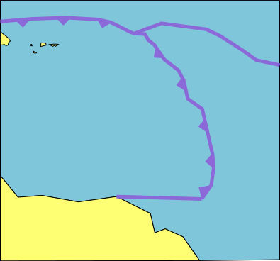
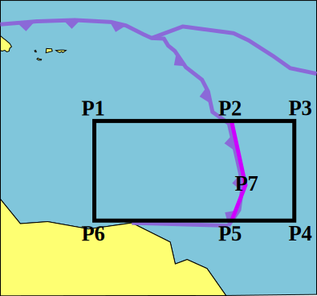
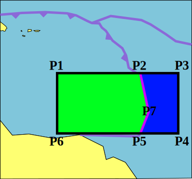
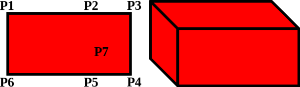
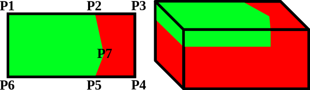
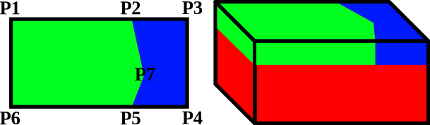
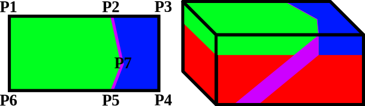

Painting in the world
=====================

```{todo}
Explain how to think about adding features to the world (they paint over each other, but can use/blend with the previous "color"/value). We need to note that the picture below are for composition (which starts with zero everywhere for all compositions, temperature starts with an adiabaic profile). The text and images below are already added mostly to test/show functionality (SVG images and cards).
```
Peparing a topographic map
--------------------------

Some introduction test to this section...

::::{grid} 3

:::{grid-item-card}

**Starting with a "geologic map"**


:::
:::{grid-item-card}

**Now we select a region and define points**


:::
:::{grid-item-card}

**Coloring in the rest of the region**


:::
::::


Using the topographic map to make a 3D model
--------------------------------------------

Some introduction test to this section...

:::{card}

**We start with a box without compositions**


:::


:::{card}

**Next we add a mantle compostion**


:::


:::{card}

**Now we add an overriding plate**



:::

:::{card}

**Then we add an oceanic plate**



:::

:::{card}

**Finally, we add a slab, the "Painting" of the model is now complete**



:::
